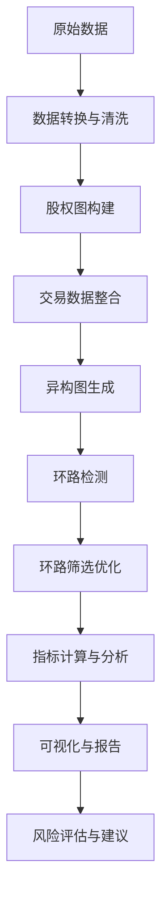

# 物产中大图风控系统

## 项目概述

本项目是"物产中大图风控系统"，是一个基于图论和机器学习的企业风险控制系统，旨在通过整合和分析企业股权与交易数据，构建企业间的复杂关系图谱，识别潜在的股权循环、交易异常等风险模式。系统采用模块化设计，提供从数据处理到风险分析的完整解决方案。

## 🎯 核心特色

- **🔄 先进的环路检测算法**：支持3-8节点多种复杂环路模式检测
- **⚡ 超高性能优化**：核心算法实现70倍性能提升
- **🔧 灵活的参数配置**：提供严格/宽松/平衡/性能四种预设模式
- **📊 全面可视化分析**：自动生成阈值推荐和风险评估报告
- **🖥️ 跨平台兼容**：支持Windows/Linux/macOS，提供NetworkX和igraph双引擎
- **📈 智能风险评分**：多维度指标融合的风险评估体系

## 🚀 功能特点

### 核心功能
1. **数据转换与清洗**：将原始数据（Excel/CSV）转换为标准化格式
2. **股权图构建**：基于股权穿透数据构建企业关系网络
3. **异构图生成**：整合股权关系与交易数据的复合图结构
4. **智能风险检测**：多算法融合的风险识别引擎
5. **交易关系分析**：深度挖掘交易模式和异常行为
6. **股东情况分析**：股权集中度和控制关系评估

### 新一代环路检测系统
- **🔍 多层级检测**：支持3-8节点环路，覆盖简单到复杂的所有模式
- **⚡ 性能突破**：优化后的筛选算法实现3分钟→2.6秒的性能飞跃
- **🎯 精准筛选**：从25,235个候选环路中精确识别65个高风险目标
- **🔧 智能配置**：基于数据特征自动推荐最优阈值参数
- **📊 可视化分析**：全方位的指标分布和相关性分析

### 参数配置与优化系统
- **📋 集中化配置**：`config_parameters.py` 统一管理所有可调参数
- **🎛️ 多模式支持**：严格/宽松/平衡/性能四种预设配置
- **📖 详细文档**：每个参数都有完整的说明和推荐值
- **🔄 动态调整**：支持运行时参数修改和配置保存
- **✅ 参数验证**：自动检查参数合理性和兼容性

### 可视化分析工具
- **📈 指标分布分析**：9种核心指标的全面分布可视化
- **🔗 相关性分析**：指标间关系的热力图分析
- **🎯 阈值影响分析**：不同参数设置对结果的影响评估
- **⚠️ 风险等级分析**：多层次风险分类和特征分析
- **📋 智能推荐报告**：基于数据特征的阈值优化建议

## 🛠️ 技术架构

### 核心技术栈
- **开发语言**：Python 3.8+
- **图计算引擎**：NetworkX + igraph（双引擎支持）
- **数据处理**：Pandas + NumPy
- **可视化**：Matplotlib + Seaborn
- **机器学习**：Scikit-learn（风险评分）
- **并行计算**：Multiprocessing（性能优化）

### 系统架构
```
系统核心层
├── 数据处理层（Data Processing Layer）
│   ├── Excel/CSV数据转换
│   ├── 数据清洗与标准化
│   └── 数据验证与质量检查
├── 图构建层（Graph Construction Layer）
│   ├── 股权关系图构建
│   ├── 交易网络构建
│   └── 异构图整合
├── 算法引擎层（Algorithm Engine Layer）
│   ├── 环路检测引擎（igraph/NetworkX）
│   ├── 风险评分引擎
│   └── 异常检测算法
├── 分析服务层（Analysis Service Layer）
│   ├── 股东情况分析
│   ├── 交易关系分析
│   └── 风险评估服务
└── 可视化层（Visualization Layer）
    ├── 统计图表生成
    ├── 风险报告生成
    └── 交互式分析界面
```

## 📁 项目结构

```
物产中大图风控系统/
├── 📂 code/                          # 核心代码模块
│   ├── 🔧 config_parameters.py       # 参数配置中心
│   ├── 🔄 loop_detection.py          # 环路检测（igraph版）
│   ├── 🔄 loop_detection_nx.py       # 环路检测（NetworkX版，Windows兼容）
│   ├── ⚡ loop_filter_script.py      # 高性能环路筛选
│   ├── 📊 loop_metrics_visualization.py  # 可视化分析工具
│   ├── 🏗️ graph_builder.py          # 图构建模块
│   ├── 📈 add_transaction.py         # 交易数据整合
│   ├── 📋 exploratory_analysis.py    # 探索性分析
│   ├── 💎 loop_profiling.py          # 环路画像分析
│   └── 👥 analyze_control_edges.py   # 股东控制关系分析
├── 📂 data/                          # 原始数据存储
├── 📂 model/                         # 图模型文件
│   ├── final_heterogeneous_graph.graphml
│   └── simplified_loop_detection_graph.graphml
├── 📂 outputs/                       # 输出结果目录
│   ├── 📊 reports/                   # 分析报告
│   ├── 🔄 loop_results/              # 环路检测结果
│   ├── 🔍 loop_analysis/             # 环路深度分析
│   ├── 🔍 loop_filter/               # 筛选后的环路
│   ├── 👥 shareholder_analysis/      # 股东分析结果
│   ├── 📈 visualizations/            # 可视化图表
│   └── 📝 log/                       # 系统日志
├── 📂 config/                        # 配置文件
├── 📂 backup/                        # 备份文件
├── 📄 main.py                        # 主执行脚本
├── 📄 requirements.txt               # 依赖列表
├── 📄 README.md                      # 项目说明
└── 📄 环路筛选参数配置教程.md         # 参数配置详细教程
```

## 🔄 核心处理流程

### 完整数据处理管道



### 详细执行步骤

1. **📊 数据预处理** (`convert_excel_to_csv.py`)
   - Excel文件自动转换为CSV格式
   - 数据清洗和标准化处理
   - 数据质量检查和异常值处理

2. **🏗️ 图结构构建** (`graph_builder.py`)
   - 基于股权数据构建企业关系图
   - 计算节点属性和边权重
   - 生成GraphML格式的图文件

3. **🔗 异构图整合** (`add_transaction.py`)
   - 整合股权关系和交易数据
   - 构建多类型节点和边的异构图
   - 支持复杂的企业关系建模

4. **🔍 环路检测引擎** (`loop_detection.py` / `loop_detection_nx.py`)
   - 支持3-8节点的多种环路模式
   - 双引擎支持：igraph（高性能）+ NetworkX（兼容性）
   - 可配置的检测深度和范围

5. **⚡ 高性能筛选** (`loop_filter_script.py`)
   - 70倍性能提升的优化算法
   - 智能筛选规则和阈值应用
   - 多维度风险评分计算

6. **📈 可视化分析** (`loop_metrics_visualization.py`)
   - 全面的指标分布分析
   - 相关性和阈值影响分析
   - 自动生成推荐报告

7. **📋 深度分析** (`loop_profiling.py`, `analyze_control_edges.py`)
   - 环路画像和特征提取
   - 股东控制关系分析
   - 风险等级评估

## 🚀 快速开始

### 环境配置

```bash
# 1. 克隆项目（如果适用）
git clone [项目地址]
cd 物产中大图风控系统

# 2. 安装依赖
pip install -r requirements.txt

# 3. 验证环境
python -c "import networkx, pandas, matplotlib; print('环境配置成功！')"
```

### 运行方式

#### 🎯 一键执行（推荐）
```bash
python main.py
```

#### 🔧 模块化执行
```bash
# 数据处理
python code/convert_excel_to_csv.py
python code/graph_builder.py
python code/add_transaction.py

# 环路分析
python code/loop_detection.py          # 或 loop_detection_nx.py (Windows)
python code/loop_filter_script.py      # 高性能筛选

# 可视化分析
python code/loop_metrics_visualization.py

# 深度分析
python code/loop_profiling.py
python code/analyze_control_edges.py
```

#### ⚙️ 参数配置
```bash
# 查看和修改配置参数
python code/config_parameters.py

# 应用预设配置模式
python -c "
from code.config_parameters import config
config.apply_quick_config('strict_mode')  # 严格模式
config.print_current_config()
"
```

## 📊 输出结果说明

### 核心输出文件
- **📈 可视化图表** (`outputs/visualizations/`)
  - `loop_metrics_distribution.png` - 指标分布图
  - `correlation_analysis.png` - 相关性分析
  - `threshold_analysis.png` - 阈值影响分析
  - `risk_analysis.png` - 风险等级分析

- **📋 分析报告** (`outputs/reports/`)
  - `threshold_recommendations.txt` - 阈值推荐报告
  - `loop_analysis_summary.csv` - 环路分析汇总
  - `risk_assessment_report.md` - 风险评估报告

- **🔍 检测结果** (`outputs/loop_results/`, `outputs/loop_filter/`)
  - `equity_loops_optimized.txt` - 完整环路检测结果
  - `filtered_high_risk_loops.csv` - 筛选后的高风险环路
  - `loop_statistics.json` - 检测统计信息

### 性能指标
- **检测速度**：25,235个环路 → 2.6秒处理完成
- **筛选精度**：从候选环路中识别出65个高风险目标
- **内存优化**：支持大规模图数据处理（10万+节点）
- **兼容性**：Windows/Linux/macOS全平台支持

## ⚙️ 配置与优化

### 预设配置模式

| 模式 | 适用场景 | 交易金额阈值 | 风险分数阈值 | 预期结果比例 |
|------|----------|--------------|--------------|--------------|
| **严格模式** | 重点监控 | ≥100万元 | ≥0.5 | ~7.5% |
| **平衡模式** | 日常分析 | ≥10万元 | ≥0.3 | ~26.9% |
| **宽松模式** | 全面排查 | ≥1万元 | ≥0.1 | ~57.5% |
| **性能模式** | 快速检测 | 优化性能 | 降低精度 | 可配置 |

### 参数配置指南

详细的参数配置教程请参考：[环路筛选参数配置教程.md](./环路筛选参数配置教程.md)

## 🔧 系统要求

### 基础环境
- **Python版本**：3.8+ 
- **内存要求**：建议8GB+（大数据集需要16GB+）
- **存储空间**：建议10GB+（包含数据和输出文件）
- **操作系统**：Windows 10+/macOS 10.14+/Ubuntu 18.04+

### 依赖库版本
```
pandas>=1.3.0
numpy>=1.21.0
networkx>=2.6.0
matplotlib>=3.4.0
seaborn>=0.11.0
python-igraph>=0.9.0  # 可选，Linux/macOS推荐
scikit-learn>=1.0.0
```

## 🐛 故障排除

### 常见问题

1. **Windows系统igraph安装失败**
   ```bash
   # 使用NetworkX版本
   python code/loop_detection_nx.py
   ```

2. **中文字体显示问题**
   - 系统会自动尝试配置中文字体
   - 如有问题，请安装SimHei或Arial Unicode MS字体

3. **内存不足错误**
   ```python
   # 在config_parameters.py中调整
   config.loop_detection.max_cycles_to_process = 50000  # 减少处理量
   config.loop_detection.memory_limit_mb = 2048         # 降低内存限制
   ```

4. **性能优化建议**
   - 启用多进程：`enable_multiprocessing = True`
   - 使用igraph引擎（Linux/macOS）
   - 应用性能模式配置

## 🤝 贡献指南

### 代码规范
- 遵循PEP 8编码规范
- 使用中文注释和文档字符串
- 保持模块化和可扩展性设计

### 提交流程
1. Fork项目仓库
2. 创建功能分支
3. 编写测试用例
4. 提交Pull Request

## 📄 许可证

本项目采用 [MIT许可证](LICENSE)

## 📧 联系方式

如有问题或建议，请联系项目维护团队。

---

**🎯 物产中大图风控系统 - 让风险控制更智能、更精准！**
